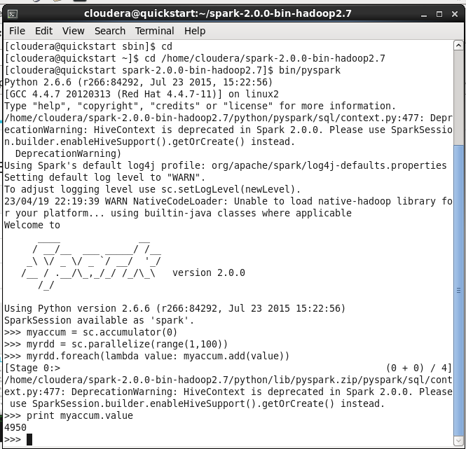
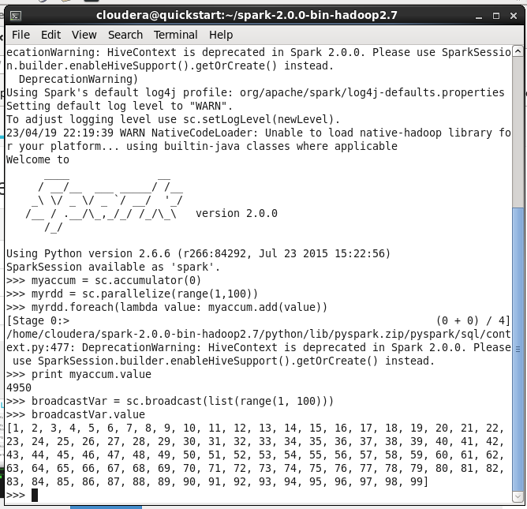
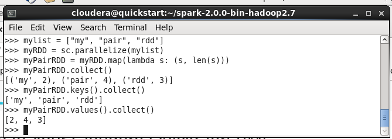
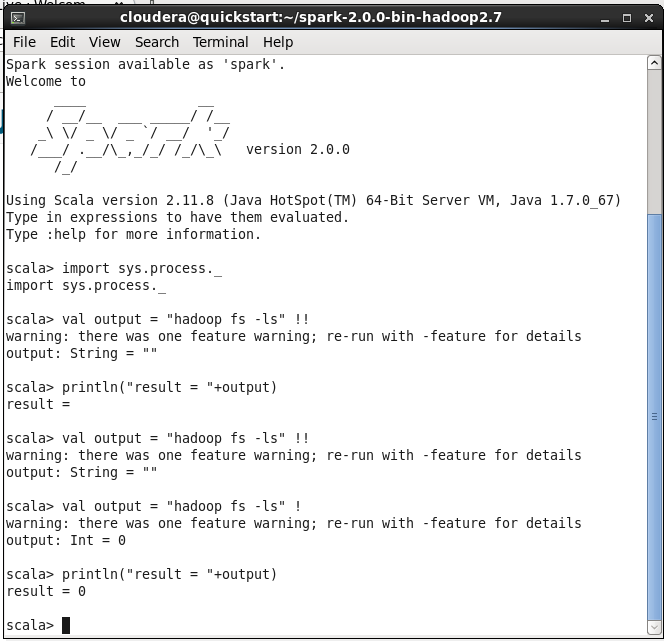
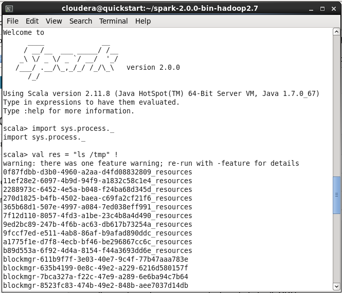
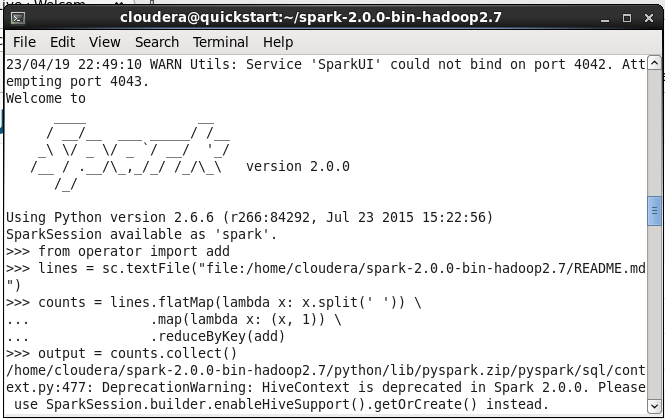

# BIG-DATA_Chapter3
### **Nama**      : Ahmad Thariq Ramadhan
### **Kelas**     : TI -3B
### **Tugas 4**
# Hasil Screenshot dan Penjelasan (Chapter 3)

# 1. Accumulator

Code diatas memiliki fungsi untuk membuat sebuah variabel accumulator yang dinamakan myaccum dengan nilai awal 0 menggunakan metode sc.accumulator yang disediakan oleh SparkContext sc. Kemudian membuat sebuah RDD dinamakan myrdd dengan memparallelkan kisaran angka dari 1 hingga 99. Fungsi lambda yang dilewatkan ke operasi foreach menambahkan nilai dari setiap elemen ke dalam accumulator myaccum. Mencetak nilai dari accumulator menggunakan metode value. Output dari kode tersebut adalah jumlah dari semua elemen dalam RDD, yang bernilai 4950.

# 2. BroadCast

Code diatas memiliki fungsi untuk membuat variabel broadcastVar dengan daftar bilangan bulat dari 1 hingga 99 menggunakan metode sc.broadcast.

# 3. PairRDD

Code diatas memiliki fungsi untuk membuat sebuah RDD bernama myRDD dengan tiga elemen menggunakan metode parallelize dari SparkContext sc. Selanjutnya, sebuah Pair RDD dengan nama myPairRDD dibuat dari myRDD dengan menggunakan metode map. Fungsi lambda yang dilewatkan ke metode map akan mengembalikan tuple yang terdiri dari elemen RDD dan panjangnya.

# 4. SystemCommandsOutput

Code diatas menggunakan perintah hadoop fs -ls dan dijalankan menggunakan operator disimpan dalam variabel output. Hasil dari perintah tersebut akan dicetak ke layar dengan menggunakan println. Pada Scala akan menampilkan keluaran dari command shell dan mengembalikan hasil sebagai String dalam bentuk keluaran tersebut. Dalam hal ini, variabel output akan berisi output dari perintah hadoop fs -ls.

# 5. SystemCommandsReturnCode

Code diatas menggunakan perintah ls /tmp dan dijalankan menggunakan operator dan disimpan dalam variabel res. Hasil dari perintah tersebut akan dicetak ke layar dengan menggunakan println. Jika perintah berhasil dijalankan, maka nilai variabel res akan sama dengan 0 jika tidak non zero.

# 6. WordCount

.png)
.png)
.png)
.png)
.png)
.png)

Code diatas memiliki fungsi untuk membaca file README.md menggunakan metode textFile dari SparkContext sc. Teks dalam file tersebut dibagi menjadi kata-kata dengan. Setiap kata dalam RDD tersebut akan dibuat menjadi tuple dengan nilai awal 1 melalui fungsi map.Hasil penghitungan jumlah kemunculan kata-kata disimpan dalam variabel output menggunakan metode collect, dan kemudian dicetak ke layar menggunakan for loop untuk mengiterasi setiap kata dan jumlah kemunculan dalam variabel output.

# Tugas Praktikum 2

## Kode 1

sc: singkatan dari SparkContext, objek utama untuk berinteraksi dengan Spark dalam lingkungan Python atau Scala.

accumulator: objek di Spark yang dapat diakses secara paralel dan dapat digunakan untuk menjalankan operasi agregasi seperti penghitungan jumlah atau rata-rata dalam lingkungan yang terdistribusi.

parallelize: metode pada objek SparkContext yang mengubah koleksi objek menjadi RDD (Resilient Distributed Datasets) yang terdistribusi secara paralel di beberapa node dalam kluster Spark.

lambda: fungsi anonim dalam Python yang digunakan untuk operasi pemetaan atau filtering pada data RDD.

value: metode yang digunakan untuk mengembalikan nilai dalam variabel yang diakses secara bersamaan dalam lingkungan yang terdistribusi.

## Kode 2

broadcast: mekanisme dalam Spark untuk mengirim data besar ke setiap node dalam kluster tanpa mengulanginya untuk setiap tugas pemrosesan.

list: struktur data dalam Python yang digunakan untuk menyimpan kumpulan elemen yang terurut dan dapat diakses dengan indeks.

range: fungsi dalam Python yang menghasilkan urutan angka dalam rentang tertentu.

## Kode 3

textFile: metode pada objek SparkContext yang digunakan untuk membaca file teks dalam RDD.

filter: metode pada RDD yang digunakan untuk memfilter elemen dengan kriteria tertentu.

cache: metode pada RDD yang digunakan untuk menyimpan RDD di memori untuk akses yang lebih cepat.

count: metode pada RDD yang mengembalikan jumlah elemen dalam RDD.

## Kode 4

map: metode pada RDD yang digunakan untuk melakukan operasi pemetaan pada setiap elemen dalam RDD.

collect: metode pada RDD yang mengembalikan semua elemen RDD ke driver program.

len: fungsi dalam Python yang mengembalikan jumlah elemen dalam struktur data.

keys: metode pada RDD yang mengembalikan kunci dari setiap pasangan kunci-nilai dalam RDD.

values: metode pada RDD yang mengembalikan nilai dari setiap pasangan kunci-nilai dalam RDD.

## Kode 5

defaultParallelism: konfigurasi pada Spark yang menentukan jumlah partisi RDD secara default.

getNumPartitions: metode pada RDD yang mengembalikan jumlah partisi RDD.

mapPartitionsWithIndex: metode pada RDD yang digunakan untuk melakukan operasi pemetaan pada setiap partisi RDD dengan indeks partisi yang terkait.

repartition: metode pada RDD yang digunakan untuk mengubah jumlah partisi RDD menjadi jumlah yang diinginkan.

coalesce: metode pada RDD yang digunakan untuk menggabungkan beberapa partisi menjadi satu partisi.

toDebugString: metode pada RDD yang mengembalikan informasi debugging RDD.

## Kode 6

flatMap: metode pada RDD yang digunakan untuk melakukan operasi pemetaan dan menghasilkan beberapa keluaran untuk setiap masukan.

reduceByKey: metode pada RDD yang mengurangi nilai dari pasangan kunci-nilai yang sama dengan operasi tertentu.

split: metode pada string dalam Python yang memisahkan string menjadi beberapa substring berdasarkan pemisah tertentu.
